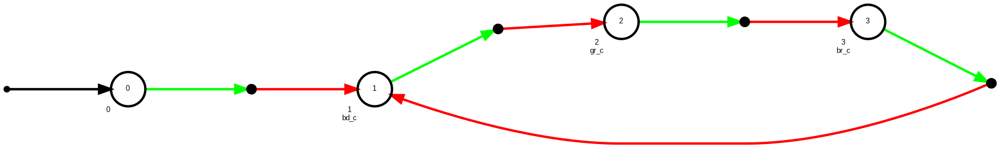
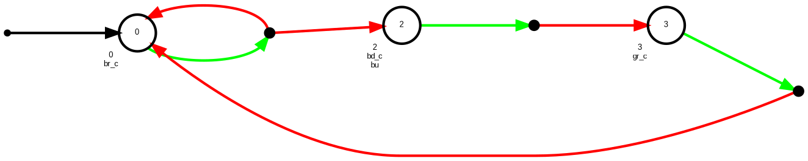
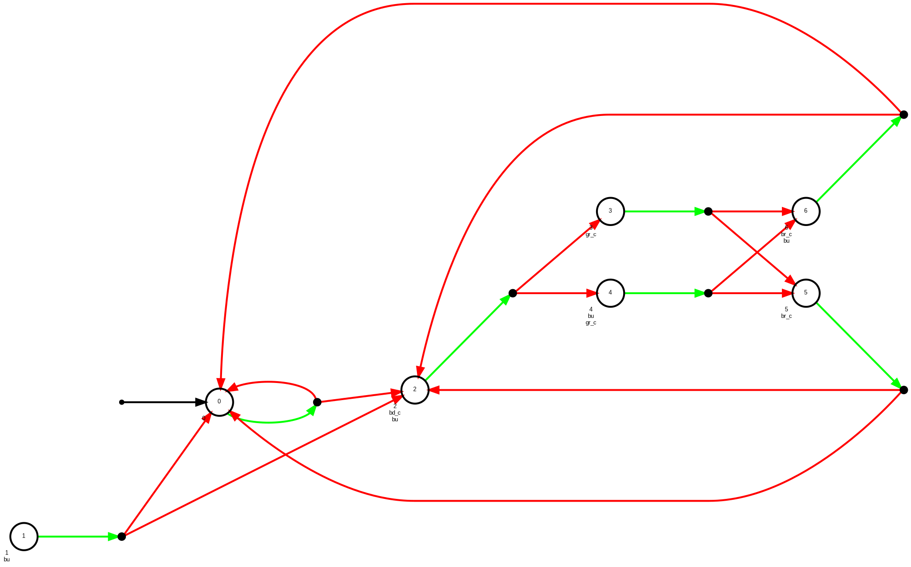
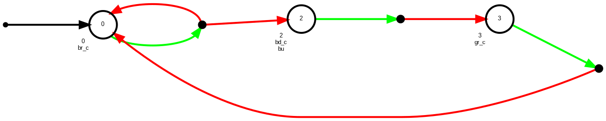
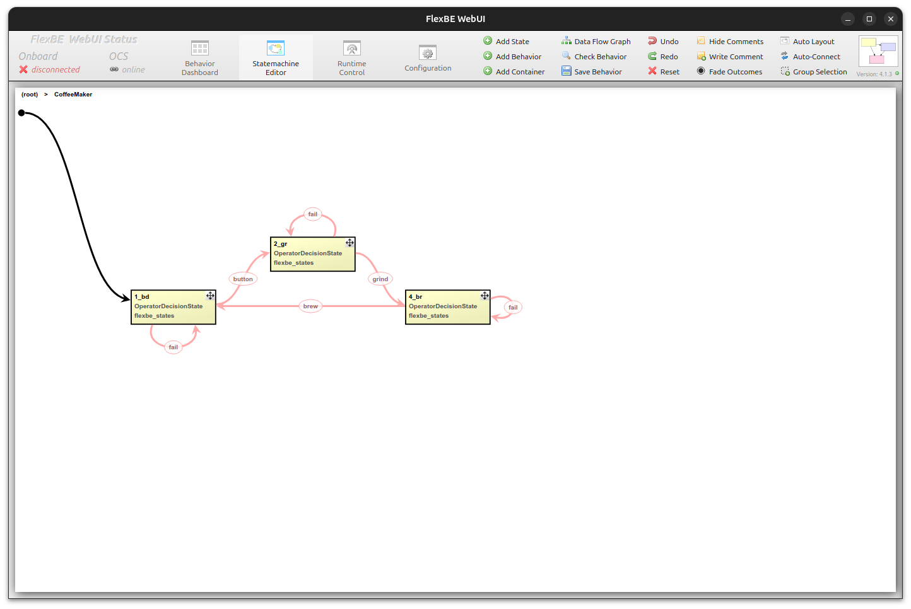

# Coffee Maker Example

The coffee maker example is a classic for GR(1) synthesis using Slugs.


* Rüdiger Ehlers. *Symmetric and Efficient Synthesis*. PhD thesis, Universität des Saarlandes, Saarbrücken, Germany, 2013.

* Rüdiger Ehlers, Stéphane Lafortune, Stavros Tripakis, and Moshe Y. Vardi. "Supervisory control and reactive synthesis: A comparative introduction." *Discrete Event Dynamic Systems*, 27(2):209–260, 2017.

* Rüdiger Ehlers. "A gentle introduction to reactive synthesis." Online tutorial with [video lecture](https://www.ruediger-ehlers.de/blog/introtoreactivesynthesis.html), 2022. (accessed 2026-05-01).

The model is intentionally small: it is meant for learning about GR(1) synthesis.
Our version extends the example to include the possibility of failures and
demonstrates several different encoding options in YAML capability form.

This write-up presumes the workspace is built as described in the examples
[README](../../README.md).

## Capability Summary

The base capability model ([`coffee_capabilities.yaml`](../../example/coffee_maker/capabilities/coffee_capabilities.yaml))
defines a strict three-step sequential coffee-making flow:

| Capability | Interface | Preconditions | Postconditions |
|---|---|---|---|
| `bd` | `LogState` | — | `bd_c` |
| `gr` | `LogState` | `bd_c` | `gr_c` |
| `br` | `LogState` | `gr_c` | `br_c` |

`bd` denotes our button detector and should detect a button press (full autonomy, `autonomy: done: 3`). `gr` grinds
coffee only after button detection completes (`bd_c`). `br` brews only after
grinding completes (`gr_c`). The synthesis request uses `initial_conditions:
[bd_a]` (button detection activated) and `goals: [br_c]` (brewing complete).

The extended model
([`coffee_capabilities_extended.yaml`](../../example/coffee_maker/capabilities/coffee_capabilities_extended.yaml))
models the system using a FlexBE `OperatorDecisionState` capability
that models the possibility of an adversarial environment failing
to complete an action.  The capability file encodes parameters
used in the FlexBE state machine as well as the logical requirements
of the discrete transitions.

| Capability | Interface | Outcomes | Preconditions | Postconditions |
|---|---|---|---|---|
| `bd` | `OperatorDecisionState` | `button` (completed), `fail` (failure) | `!gr`, `!bd` | completed: `bd`, `!gr` / failure: `!bd` |
| `gr` | `OperatorDecisionState` | `grind` (completed), `fail` (failure) | `bd` | completed: `!bd`, `gr` / failure: `bd` |
| `br` | `OperatorDecisionState` | `brew` (completed), `fail` (failure) | `gr` | completed: `!gr` / failure: `gr` |

## Inspect The Inputs

The checked-in example files are:

| Role | File |
|---|---|
| Base capabilities | [`coffee_capabilities.yaml`](../../example/coffee_maker/capabilities/coffee_capabilities.yaml) |
| Extended capabilities | [`coffee_capabilities_extended.yaml`](../../example/coffee_maker/capabilities/coffee_capabilities_extended.yaml) |
| Full GR(1) spec | [`coffee_full_spec.yaml`](../../example/coffee_maker/specs/coffee_full_spec.yaml) |
| Seed spec (capability-based) | [`coffee_demo_capabilities_spec.yaml`](../../example/coffee_maker/specs/coffee_demo_capabilities_spec.yaml) |
| Slugs preprocess pipeline definition | [`slugs_preprocesses_def.yaml`](../../example/common/pipelines/slugs_preprocesses_def.yaml) |
| Generic preprocess pipeline definition | [`preprocesses_def.yaml`](../../example/common/pipelines/preprocesses_def.yaml) |
| Full-spec process pipeline | [`full_spec_processes_def.yaml`](../../example/common/pipelines/full_spec_processes_def.yaml) |
| Capability process pipeline | [`capability_processes_def.yaml`](../../example/common/pipelines/capability_processes_def.yaml) |
| Parsed-activation process pipeline | [`capability_processes_def_parsed.yaml`](../../example/common/pipelines/capability_processes_def_parsed.yaml) |

## Run The Generic Preprocess Pipeline

The launch file
([`coffee_preprocess_example.launch.py`](../../launch/coffee_preprocess_example.launch.py))
defaults to the coffee capabilities:

```bash
ros2 launch flexbe_synthesis_examples coffee_preprocess_example.launch.py
```

This launch only runs the generic preprocessing
pipeline, writes intermediate YAML files for inspection, and then exits. It does not leave a
synthesis action server running, does not invoke Slugs, and does not produce a
Mealy graph or FlexBE behavior.

Generated files are written under `FLEXBE_SYNTHESIS_HOME` when that environment
variable is set, or under `~/.flexbe_synthesis` otherwise. For the default
`coffee_maker` system, inspect:

- `workspace_defn.yaml`
- `coffee_maker/configs/coffee_maker_system_capabilities.yaml`
- `coffee_maker/configs/coffee_maker_transition_relations.yaml`
- `coffee_maker/configs/coffee_maker_discrete_abstraction.yaml`

## Run a Synthesis Demo

To synthesize a behavior, run a launch file with a processes pipeline. The base
capability coffee demo is the simplest place to start.

In terminal 1, start the synthesis server:

```bash
ros2 launch flexbe_synthesis_examples coffee_capabilities_example.launch.py
```

In terminal 2, submit the coffee request:

```bash
ros2 run flexbe_synthesis_examples request_coffee
```

`request_coffee` sends `system_name:=coffee_maker`, `spec_name:=CoffeeSM`,
`initial_conditions:=[bd_a]`, `goals:=[br_c]`, and no state-machine outcomes.

`spec_name` and `spec_path` have separate roles. The launch file's `spec_path`
selects which GR(1) YAML file is loaded and synthesized. The request `spec_name`
labels the output directory and generated artifacts under
`~/.flexbe_synthesis/coffee_maker/`. The checked-in coffee spec files declare
`spec_name: coffee_maker`, so using the default request label `CoffeeSM` may
produce a non-fatal loader/compiler warning about the name mismatch. Override
`spec_name:=coffee_maker` if you want artifact names to match the spec file's
internal name.

This run uses the capability process pipeline, which compiles the generated
GR(1) specification, invokes Slugs, converts the Slugs automaton, reduces the
state machine, and writes the synthesized outputs for inspection.

## Mealy Graph Output

The capability process pipeline includes a `slugs_mealy_graph` step that writes
the synthesized automaton from the run above as a Mealy machine graph. The
output is controlled by `mealy_graph_config` in
[`processes_data.yaml`](../../example/coffee_maker/pipelines/processes_data.yaml).
With `draw_graph: true`, the step writes `.dot`, `.png`, and `.pdf` files under
`~/.flexbe_synthesis/coffee_maker/CoffeeSM/`.

The graph encodes the synthesized Mealy machine:

- **Circles** — automaton states, labeled with their ID and the proposition(s)
  that are true in that state (e.g. `bd_c`, `gr_c`, `br_c`)
- **Small filled circles** — intermediate Mealy transition nodes separating
  environment input from system output
- **Green arrows** — system outputs (capability activation requests sent to the robot)
- **Red arrows** — environment inputs (capability completion signals received from the robot)

### Capabilities-Based Automaton

Running with `coffee_capabilities_example.launch.py` produces a four-state
sequential automaton (`CoffeeSM.png`):



Starting from state 0 (idle), the system activates `bd` (green); the environment
signals `bd_c` (red) advancing to state 1. From state 1 the system activates
`gr`; `gr_c` advances to state 2. From state 2 the system activates `br`; `br_c`
advances to state 3 (goal). The arc from state 3 back encodes the liveness
guarantee: the synthesized controller loops back to re-detect a button press when
the goal state is revisited.

### Automaton Reduction (`slugs_sm_reducer`)

The pipeline runs `slugs_sm_reducer` between the two `slugs_mealy_graph` steps.
The reducer applies two passes to shrink the raw Slugs automaton:

1. **Prune unreachable states** — repeatedly removes states that have no
   incoming transitions (except the root, which is kept as the initial state).
2. **Merge equivalent states** — identifies pairs of states with identical
   output propositions and identical transition targets, and redirects all
   incoming edges of the duplicate to the canonical state.

For the capabilities-based coffee model, states 0 and 3 are both idle waiting
states that activate `bd` and transition to `bd_c` — they are equivalent and are
merged, reducing the automaton from four states to three:



The full-spec launch (`coffee_full_spec_example.launch.py`) produces a
richer 7-state raw automaton that demonstrates more extensive reduction:



The reducer merges states with identical behavior:

- States 1, 5, and 6 are equivalent to state 0 → all collapsed into state 0
- States 3 and 4 are equivalent → collapsed into state 3




The result is the same **3-state reduced automaton** (states 0, 2, 3), a
reduction from seven states. The smaller graph maps directly to three FlexBE
states (`bd`, `gr`, `br`) with no redundant intermediate states.

## Other Coffee Launches

Run one launch file in a sourced terminal, then send the request from another
sourced terminal.

For the full-spec coffee demo:

```bash
ros2 launch flexbe_synthesis_examples coffee_full_spec_example.launch.py
ros2 run flexbe_synthesis_examples request_coffee
```

The extended capability model uses the same request client:

```bash
ros2 launch flexbe_synthesis_examples coffee_capabilities_extended_example.launch.py
ros2 run flexbe_synthesis_examples request_coffee
```

The parsed variants use a numeric `capability:0...N` output instead of one-hot
`*_a` capability activation outputs:

```bash
ros2 launch flexbe_synthesis_examples coffee_capabilities_parsed_example.launch.py
ros2 run flexbe_synthesis_examples request_coffee
```

```bash
ros2 launch flexbe_synthesis_examples coffee_capabilities_extended_parsed_example.launch.py
ros2 run flexbe_synthesis_examples request_coffee
```

## Coffee Launch Files

All launches accept `global_mappings_path`, `custom_mappings_path`,
`capabilities_path`, and `spec_path` overrides.

| Launch file | Spec source | Activation encoding | Intended use |
|---|---|---|---|
| [`coffee_full_spec_example.launch.py`](../../launch/coffee_full_spec_example.launch.py) | Complete GR(1) spec in `coffee_full_spec.yaml` | Spec-defined one-hot `*_a` outputs | Baseline coffee synthesis from a mostly complete Slugs spec |
| [`coffee_capabilities_example.launch.py`](../../launch/coffee_capabilities_example.launch.py) | Seed spec plus `coffee_capabilities.yaml` | Generated one-hot `*_a` outputs | Coffee synthesis from checked-in capabilities |
| [`coffee_capabilities_extended_example.launch.py`](../../launch/coffee_capabilities_extended_example.launch.py) | Seed spec plus `coffee_capabilities_extended.yaml` | Generated one-hot `*_a` outputs | Coffee synthesis with the extended capability set |
| [`coffee_capabilities_parsed_example.launch.py`](../../launch/coffee_capabilities_parsed_example.launch.py) | Seed spec plus `coffee_capabilities.yaml` | Parsed numeric `capability:0...N` output | Compare parsed activation encoding against the base coffee capabilities |
| [`coffee_capabilities_extended_parsed_example.launch.py`](../../launch/coffee_capabilities_extended_parsed_example.launch.py) | Seed spec plus `coffee_capabilities_extended.yaml` | Parsed numeric `capability:0...N` output | Compare parsed activation encoding against extended coffee capabilities |

## FlexBE Walkthrough

This walkthrough assumes the workspace is already built and sourced as described
in the examples [README](../../README.md), including `flexbe_behavior_engine` and
`flexbe_webui` 4.1.5+.

The extended capability model (`coffee_capabilities_extended.yaml`) uses
`OperatorDecisionState` for each step, which lets the operator confirm or abort
each coffee-making action. Use the extended launch for this walkthrough:

In terminal 1, start the synthesis server:

```bash
ros2 launch flexbe_synthesis_examples coffee_capabilities_extended_example.launch.py
```

In terminal 2, launch the FlexBE WebUI:

```bash
ros2 launch flexbe_webui flexbe_ocs.launch.py
```

In the launched FlexBE WebUI window, modify the behavior synthesis window in
the configuration tab. The quick-copy values are:

- `/flexbe_synthesis`
- `flexbe_synthesis_msgs/FlexBESynthesis`
- `coffee_maker`

After enabling synthesis, add a `StateMachine` container into the state machine
editor, display synthesis, and set:

- **Initial conditions**: `bd_a`
- **Goals**: `br_c`

Click **Synthesize**. The server generates a three-state behavior (`bd`, `gr`,
`br`) using `OperatorDecisionState` for each step. Each state presents the
operator with a decision (e.g. `grind` / `fail`) and a pre-selected suggestion
matching the desired action.



Launch FlexBE Onboard to execute:

```bash
ros2 launch flexbe_onboard behavior_onboard.launch.py
```

Refer to FlexBE [documentation](https://flexbe.readthedocs.io/en/latest/) or [tutorials](https://github.com/FlexBE/flexbe_turtlesim_demo) for more information about using FlexBE.

## Slugs Automaton Checker

After a Slugs-backed coffee synthesis run has produced a JSON automaton and
matching `.structuredslugs` file, inspect the generated automaton conversion
with the launch running in one sourced terminal and the request/inspection
commands in another:

```bash
ros2 launch flexbe_synthesis_examples coffee_full_spec_example.launch.py
ros2 run flexbe_synthesis_examples request_coffee --ros-args -p spec_name:=coffee_maker
ros2 run flexbe_synthesis_slugs check_slugs_automaton --spec-name coffee_maker
```

The utility searches the current directory, `FLEXBE_SYNTHESIS_HOME` or
`~/.flexbe_synthesis`. Use explicit JSON and structuredslugs paths when needed:

```bash
ros2 run flexbe_synthesis_slugs check_slugs_automaton \
  path/to/spec.json --structuredslugs path/to/spec.structuredslugs
```
