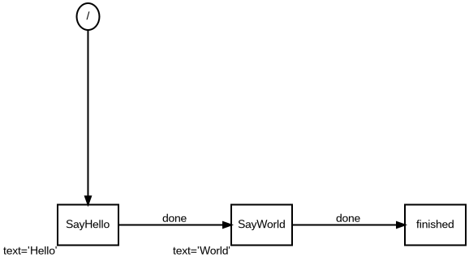
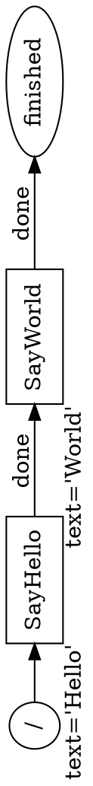
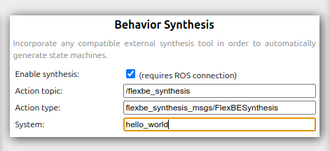
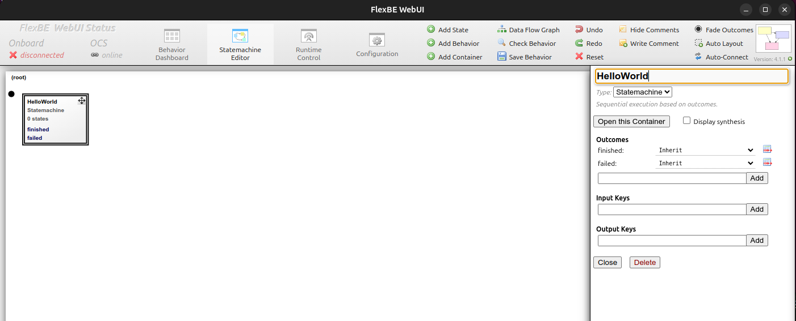
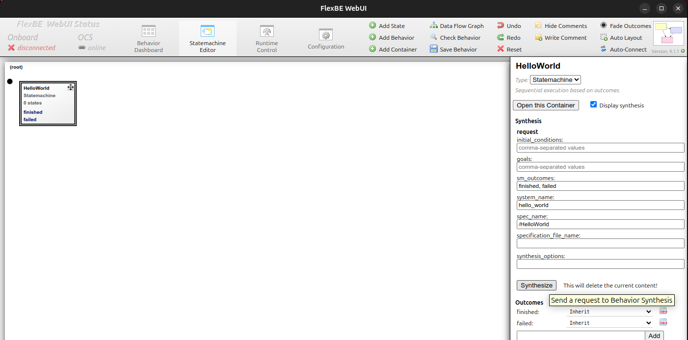
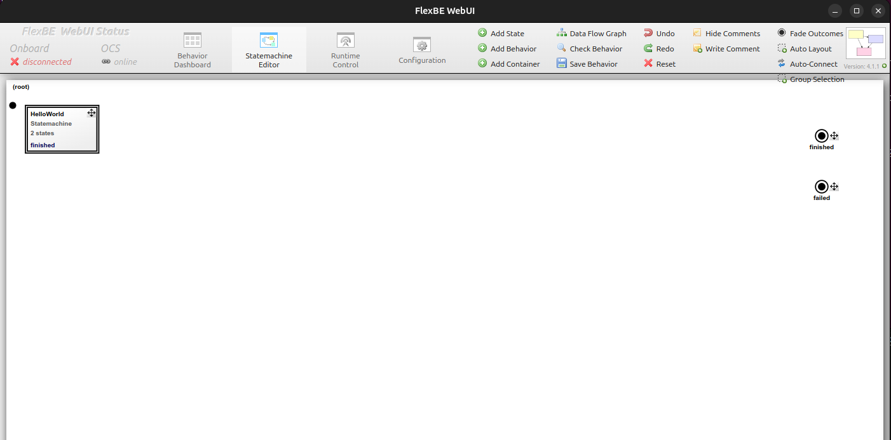
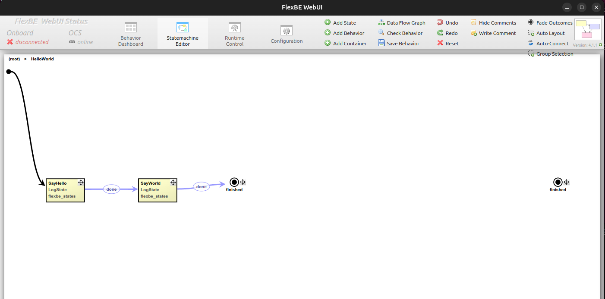
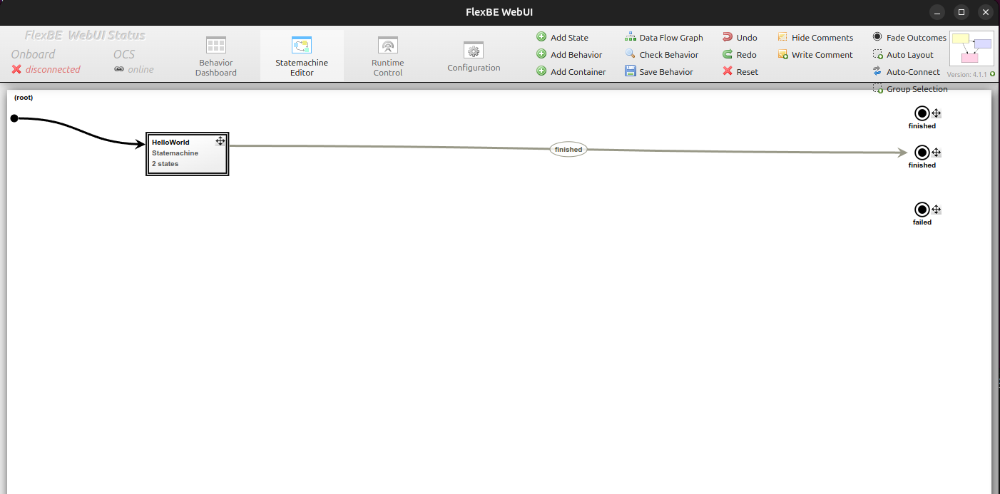
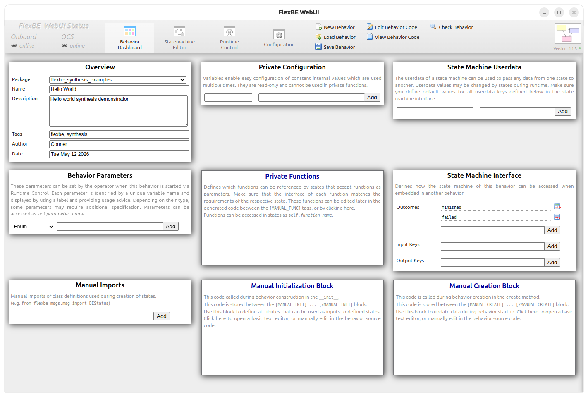
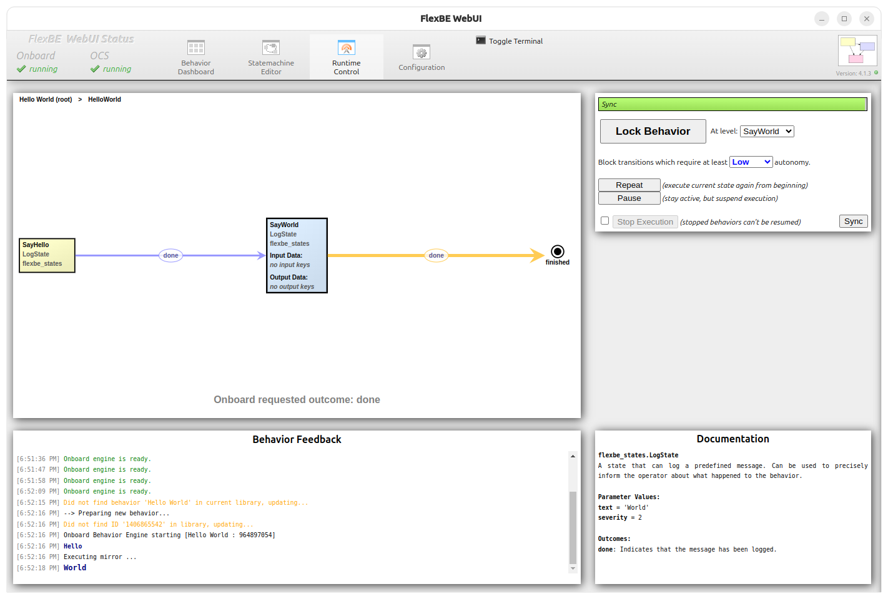

# Hello World Demo

The `hello_world` demo ([`hello_world_capabilities.yaml`](../../example/hello_world/capabilities/hello_world_capabilities.yaml))
is the smallest capability file in this package. It models a two-step sequential
task using two `LogState` capabilities: `say_hello` prints "Hello" and must run
first; `say_world` prints "World" and requires `say_hello` to have completed.

The demo exercises the full pipeline path:

1. **Generic preprocessing** (capability loader, discrete abstraction, transition relations)
2. **SM generation** from a hand-written SM definition
   ([`hello_world_sm.yaml`](../../example/hello_world/sm/hello_world_sm.yaml))
   via `sm_loader` → `sm_layout`

## Capability Summary

| Capability | Interface | Preconditions | Postconditions |
|---|---|---|---|
| `say_hello` | `LogState` | `!say_hello` | `say_hello` |
| `say_world` | `LogState` | `say_hello` | `say_world` |

## Run the Hello World Demo

In one terminal, start the synthesis server
([`hello_world_example.launch.py`](../../launch/hello_world_example.launch.py)):

```bash
ros2 launch flexbe_synthesis_examples hello_world_example.launch.py
```

On startup the server runs the preprocessing pipeline (writes outputs to
`~/.flexbe_synthesis/hello_world/`) and then waits for a synthesis
request.


In a second terminal, send the request:

```bash
ros2 run flexbe_synthesis_examples request_hello_world
```

On success the server prints the generated `HelloWorldSM` state instantiations
and the client prints a YAML dump of the result followed by the state count.
The result is also available via the FlexBE WebUI's **Synthesis** panel.

Generated intermediate YAML files are written under `FLEXBE_SYNTHESIS_HOME` when
that variable is set, or under `~/.flexbe_synthesis` otherwise.

## Pipeline Overview

```
Preprocesses (once at startup):
  workspace_crawler → (global) state_mappings → (custom) state_mappings → workspace_parser →
  capability_loader → generate_transition_relations → generate_discrete_abstraction

Processes (per synthesis request):
  sm_loader → sm_layout
```

Configuration files:

| Role | File |
|---|---|
| Preprocess pipeline definition | [`preprocesses_def.yaml`](../../example/common/pipelines/preprocesses_def.yaml) |
| Preprocess pipeline data | [`preprocesses_data.yaml`](../../example/common/pipelines/preprocesses_data.yaml) |
| Process pipeline definition | [`processes_def.yaml`](../../example/hello_world/pipelines/processes_def.yaml) |
| Process pipeline data | [`processes_data.yaml`](../../example/hello_world/pipelines/processes_data.yaml) |
| SM definition (loaded by `sm_loader`) | [`hello_world_sm.yaml`](../../example/hello_world/sm/hello_world_sm.yaml) |

`sm_loader` reads the hand-written `hello_world_sm.yaml` directly and builds the
`StateInstantiation` list without any Slugs dependency. `sm_layout` assigns
display positions for the FlexBE WebUI.

## Expected Output

By default, this example omits `specs_output_dir_path` from
[`processes_data.yaml`](../../example/hello_world/pipelines/processes_data.yaml).
The synthesis manager supplies the default output directory for the current
system and spec, such as
`~/.flexbe_synthesis/hello_world/HelloWorldSM/`.

With the Graphviz layout enabled (`use_fallback_layout: false`) and `pygraphviz`
installed, `sm_layout` writes `state_machine.dot` and `state_machine.png` there.
With the fallback layout enabled, it writes only `state_machine.dot`.

### State Machine Diagram



The diagram shows the initial state (filled circle) entering `SayHello`, which
transitions on `done` to `SayWorld`, which transitions on `done` to the
`finished` outcome. State parameters (`text='Hello'`, `text='World'`) appear as
node labels.

### Graphviz DOT Source



The full annotated `.dot` file includes computed positions. The PNG is generated
only by the Graphviz-backed layout path.


## FlexBE Synthesis

This example can also be run from FlexBE.

For FlexBE demonstration, start the synthesis manager and FlexBE WebUI.

In terminal 1:

```bash
ros2 launch flexbe_synthesis_examples hello_world_example.launch.py
```

In terminal 2:

```bash
ros2 launch flexbe_webui flexbe_ocs.launch.py
```

In the launched FlexBE WebUI window, modify the behavior synthesis window in
the configuration tab to match:

- `/flexbe_synthesis`
- `flexbe_synthesis_msgs/FlexBESynthesis`
- `hello_world`



After enabling synthesis you should be able to add a `StateMachine` container into the state
machine editor.



Display synthesis, leave the initial conditions and goals blank, and click **Synthesize**.



This should create the state machine result:



Double-click or open the container to see the resulting state machine:



After connecting container:



To execute the state machine, you need to save the behavior via the FlexBE WebUI dashboard.



This `flexbe_synthesis_examples` package is configured as a `flexbe_behaviors` package,
so you can save the demo here.  You need to specify a behavior name, description, tags,
and author.


Then start FlexBE Onboard.

```bash
ros2 launch flexbe_onboard behavior_onboard.launch.py
```

And execute via the `Runtime Control` tab in the FlexBE WebUI.



Refer to FlexBE [documentation](https://flexbe.readthedocs.io/en/latest/) or [tutorials](https://github.com/FlexBE/flexbe_turtlesim_demo) for more information about using FlexBE.
