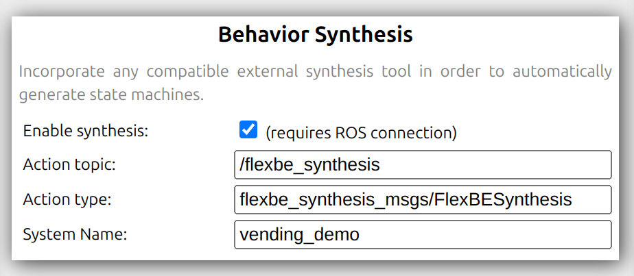
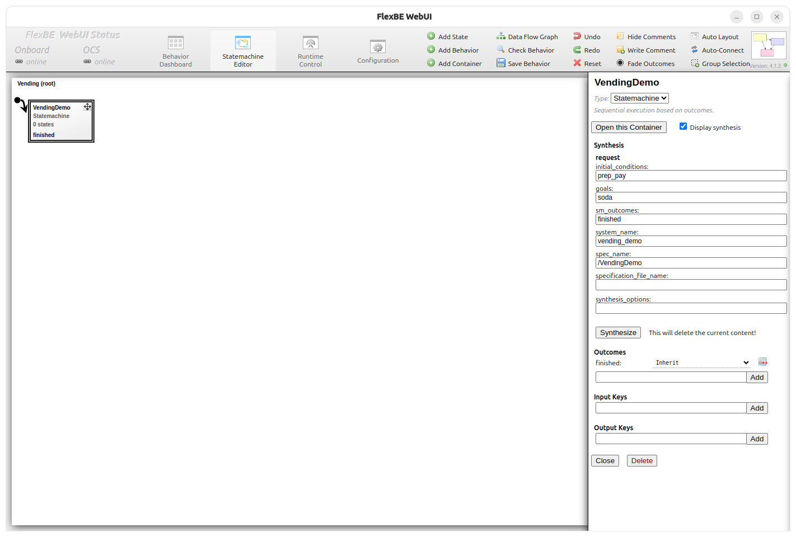
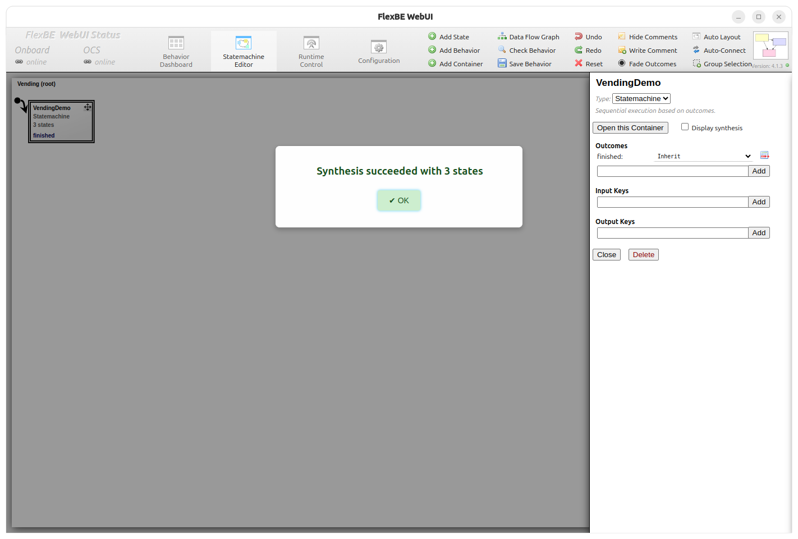
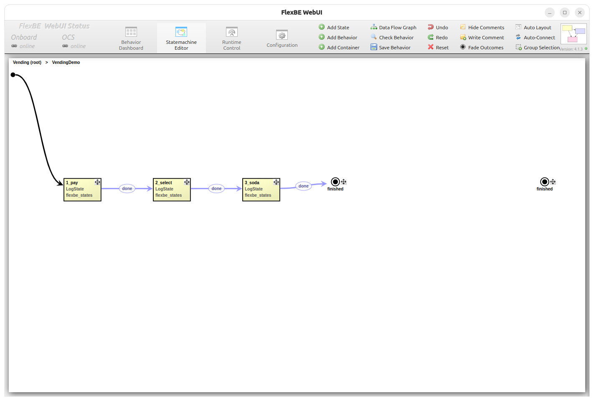
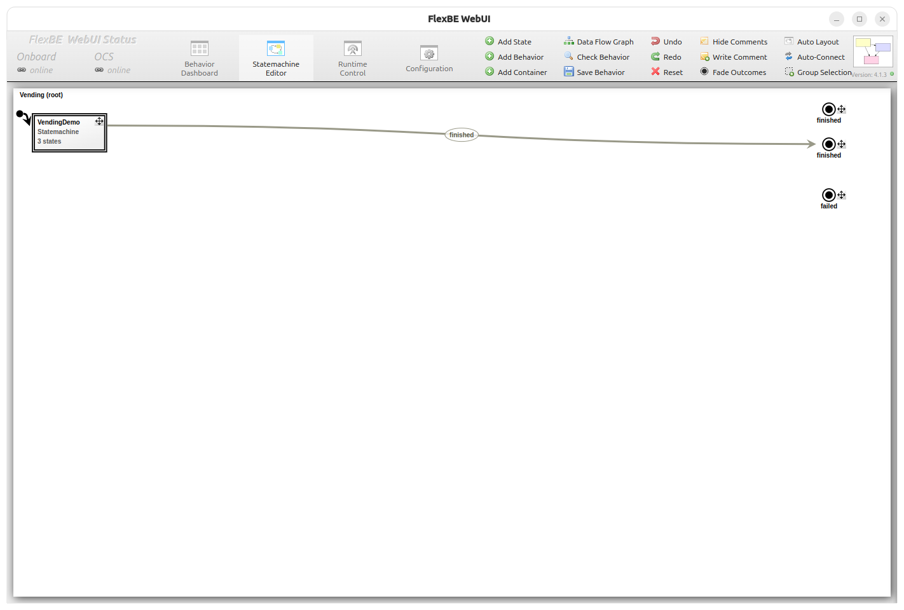
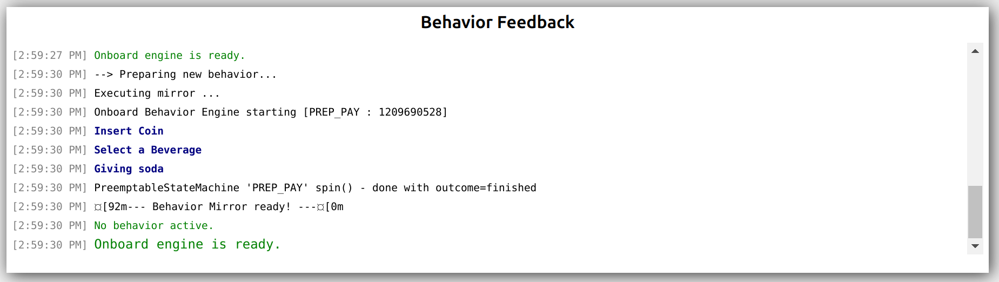

# Vending Machine Example

The vending example is the smallest end-to-end capability model intended for a
fresh FlexBE Synthesis checkout. It exercises the generic capability
preprocessors and the Slugs backend without depending on any external robot demo
packages.

This write-up presumes the workspace is built as described in the examples
[README](../../README.md).

## Capability Summary

The base capability model ([`vending_capabilities.yaml`](../../example/vending_demo/capabilities/vending_capabilities.yaml))
defines six capabilities across a payment-and-selection flow:

| Capability | Interface | Preconditions | Postconditions |
|---|---|---|---|
| `prep_pay` | `LogState` | `!prep_pay` | `prep_pay` |
| `pay` | `LogState` | `prep_pay` | `pay`, `!prep_pay`, `item=0` |
| `select` | `LogState` | `pay` | `@item`, `!pay`, `select` |
| `soda` | `LogState` | `select`, `item=1` | `soda`, `item=0`, `!select` |
| `beer` | `LogState` | `select`, `item=2` | `beer`, `item=0`, `!select` |
| `snack` | `LogState` | `select`, `item=3` | `snack`, `item=0`, `!select` |

The extended model ([`vending_capabilities_extended.yaml`](../../example/vending_demo/capabilities/vending_capabilities_extended.yaml))
adds additional capabilities. The `item` system proposition is an enumerated
variable (`soda=1`, `beer=2`, `snack=3`).

## Inspect The Inputs

The checked-in example files are:

| Role | File |
|---|---|
| Base capabilities | [`vending_capabilities.yaml`](../../example/vending_demo/capabilities/vending_capabilities.yaml) |
| Extended capabilities | [`vending_capabilities_extended.yaml`](../../example/vending_demo/capabilities/vending_capabilities_extended.yaml) |
| Full GR(1) spec | [`vending_demo_full_spec.yaml`](../../example/vending_demo/specs/vending_demo_full_spec.yaml) |
| Seed spec (capability-based) | [`vending_demo_capabilities_spec.yaml`](../../example/vending_demo/specs/vending_demo_capabilities_spec.yaml) |
| Preprocess pipeline definition | [`slugs_preprocesses_def.yaml`](../../example/common/pipelines/slugs_preprocesses_def.yaml) |
| Full-spec process pipeline | [`full_spec_processes_def.yaml`](../../example/common/pipelines/full_spec_processes_def.yaml) |
| Capability process pipeline | [`capability_processes_def.yaml`](../../example/common/pipelines/capability_processes_def.yaml) |
| Parsed-activation process pipeline | [`capability_processes_def_parsed.yaml`](../../example/common/pipelines/capability_processes_def_parsed.yaml) |

The model uses a tiny vending-machine state space with payment preparation and
drink-selection propositions.

## Run The Generic Preprocess Pipeline

The launch file ([`vending_preprocess_example.launch.py`](../../launch/vending_preprocess_example.launch.py))
defaults to the vending capabilities:

```bash
ros2 launch flexbe_synthesis_examples vending_preprocess_example.launch.py
```

This launch only runs the generic preprocessing
pipeline, writes intermediate YAML files for inspection, and then exits. It does not leave a
synthesis action server running, does not invoke Slugs, and does not produce a
Mealy graph or FlexBE behavior.

Generated intermediate YAML files are written under `FLEXBE_SYNTHESIS_HOME` when
that environment variable is set, or under `~/.flexbe_synthesis` otherwise.

For the default
`vending_demo` system, inspect:

- `workspace_defn.yaml`
- `vending_demo/configs/vending_demo_system_capabilities.yaml`
- `vending_demo/configs/vending_demo_transition_relations.yaml`
- `vending_demo/configs/vending_demo_discrete_abstraction.yaml`

## Run a Synthesis Demo

```bash
ros2 launch flexbe_synthesis_examples vending_full_spec_example.launch.py
```

When a compatible synthesis action server is running, submit the vending request:

```bash
ros2 run flexbe_synthesis_examples request_vending
```

`request_vending` sends `system_name:=vending_demo`, `spec_name:=VendingDemoSM`,
`initial_conditions:=[prep_pay_a]`, `goals:=[soda]`, and
`outcomes:=[finished]`.

`spec_name` and `spec_path` have separate roles. The launch file's `spec_path`
selects which GR(1) YAML file is loaded and synthesized. The request `spec_name`
labels the output directory and generated artifacts under
`~/.flexbe_synthesis/vending_demo/`. The checked-in vending spec files use
internal names such as `vending_demo` and `vending_demo_full_spec`, so using a
request label such as `VendingDemoSM` may produce a non-fatal loader/compiler
warning about the name mismatch. Override `spec_name` if you want artifact names
to match the loaded spec file's internal name.

Override request fields with ROS parameters when trying a different condition,
goal, output behavior name, or prebuilt specification file:

```bash
ros2 run flexbe_synthesis_examples request_vending --ros-args \
  -p goals:="[beer]" \
  -p spec_name:=BeerVendingDemoSM
```

Use `specification_file_name` when the server should load an existing spec file
instead of the launch file's default request-derived name, and use
`synthesis_options` to pass backend-specific Slugs options.

## Run Slugs Synthesis

Run one launch file in a sourced terminal, then send the request from another
sourced terminal.

For the full-spec vending demo:

```bash
ros2 launch flexbe_synthesis_examples vending_full_spec_example.launch.py
ros2 run flexbe_synthesis_examples request_vending --ros-args -p goals:="[soda]"
```

The full-spec demo accepts `soda` or `beer` as the goal.

For the capability-generated vending demo:

```bash
ros2 launch flexbe_synthesis_examples vending_capabilities_example.launch.py
ros2 run flexbe_synthesis_examples request_vending --ros-args -p goals:="[soda]"
```

The extended capability model adds `state_outcome_mappings`, a `memory` block, and `OperatorDecisionState` interfaces:

```bash
ros2 launch flexbe_synthesis_examples vending_capabilities_extended_example.launch.py
ros2 run flexbe_synthesis_examples request_vending --ros-args -p goals:="[snack]"
```

The parsed variants encode capability activation with a numeric `capability:0...N`
output instead of one-hot `*_a` outputs:

```bash
ros2 launch flexbe_synthesis_examples vending_capabilities_parsed_example.launch.py
ros2 run flexbe_synthesis_examples request_vending --ros-args -p goals:="[soda]"
```

```bash
ros2 launch flexbe_synthesis_examples vending_capabilities_extended_parsed_example.launch.py
ros2 run flexbe_synthesis_examples request_vending --ros-args -p goals:="[snack]"
```

## Vending Launch Files

All launches accept `global_mappings_path`, `custom_mappings_path`,
`capabilities_path`, and `spec_path` overrides.

| Launch file | Spec source | Activation encoding | Intended use |
|---|---|---|---|
| [`vending_full_spec_example.launch.py`](../../launch/vending_full_spec_example.launch.py) | Complete GR(1) spec in `vending_demo_full_spec.yaml` | Spec-defined one-hot `*_a` outputs | Baseline vending synthesis from a mostly complete Slugs spec |
| [`vending_capabilities_example.launch.py`](../../launch/vending_capabilities_example.launch.py) | Seed spec plus `vending_capabilities.yaml` | Generated one-hot `*_a` outputs | Vending synthesis from checked-in capabilities |
| [`vending_capabilities_extended_example.launch.py`](../../launch/vending_capabilities_extended_example.launch.py) | Seed spec plus `vending_capabilities_extended.yaml` | Generated one-hot `*_a` outputs | Vending synthesis with the extended capability set |
| [`vending_capabilities_parsed_example.launch.py`](../../launch/vending_capabilities_parsed_example.launch.py) | Seed spec plus `vending_capabilities.yaml` | Parsed numeric `capability:0...N` output | Compare parsed activation encoding against the base vending capabilities |
| [`vending_capabilities_extended_parsed_example.launch.py`](../../launch/vending_capabilities_extended_parsed_example.launch.py) | Seed spec plus `vending_capabilities_extended.yaml` | Parsed numeric `capability:0...N` output | Compare parsed activation encoding against extended vending capabilities |

The default vending request client asks for the terminal `finished` state
machine outcome. The shared `global_mappings.yaml` intentionally leaves
`failed` disabled as a terminal state machine outcome so the checked-in examples
prefer failure recovery. Override `custom_mappings_path` when trying a different
outcome policy:

```bash
ros2 launch flexbe_synthesis_examples vending_capabilities_example.launch.py \
  custom_mappings_path:=/path/to/custom_mappings.yaml
```

## FlexBE Walkthrough

This walkthrough assumes the workspace is already built and sourced as described
in the examples [README](../../README.md), including `flexbe_behavior_engine` and
`flexbe_webui` 4.1.5+.

Any of the synthesis server launch options from [Run Slugs Synthesis](#run-slugs-synthesis)
are valid for use with FlexBE. In terminal 1, start the server of your choice, for example:

```bash
ros2 launch flexbe_synthesis_examples vending_capabilities_example.launch.py
```

In terminal 2, launch the FlexBE WebUI:

```bash
ros2 launch flexbe_webui flexbe_ocs.launch.py
```

In the launched FlexBE WebUI window, modify the behavior synthesis window in
the configuration tab to match the following image. The quick-copy values are:

- `/flexbe_synthesis`
- `flexbe_synthesis_msgs/FlexBESynthesis`
- `vending_demo`

No separate system request is required.



After enabling synthesis you should be able to add a container into the state
machine editor. Display synthesis, then set the initial conditions and goals to
look like either image below and click **Synthesize**. This should create the
full three-state representation for the vending-machine problem.





You can open the container and inspect the individual states of the generated
state machine:



Here the `prep_pay` initial condition activates the `prep_pay_m` variable
which signals that payment preparation is complete and `pay` is the first state.
Specifying `prep_pay_a` as the initial condition adds a fourth state `prep_pay` to the state machine.


In this example, the discrete abstraction uses a `LogState` whose outcomes map
to the default transition outcome set. Custom terminal outcomes can be added by
supplying a mapping file through `custom_mappings_path` and requesting matching
state machine outcomes.

Next, return to the root state machine and connect the initial state and
outcomes:



Launch FlexBE Onboard:

```bash
ros2 launch flexbe_onboard behavior_onboard.launch.py
```

After running, your Behavior Output should look something like this, depending
on which drink you set as the goal:



Refer to FlexBE [documentation](https://flexbe.readthedocs.io/en/latest/) or [tutorials](https://github.com/FlexBE/flexbe_turtlesim_demo) for more information about using FlexBE.
